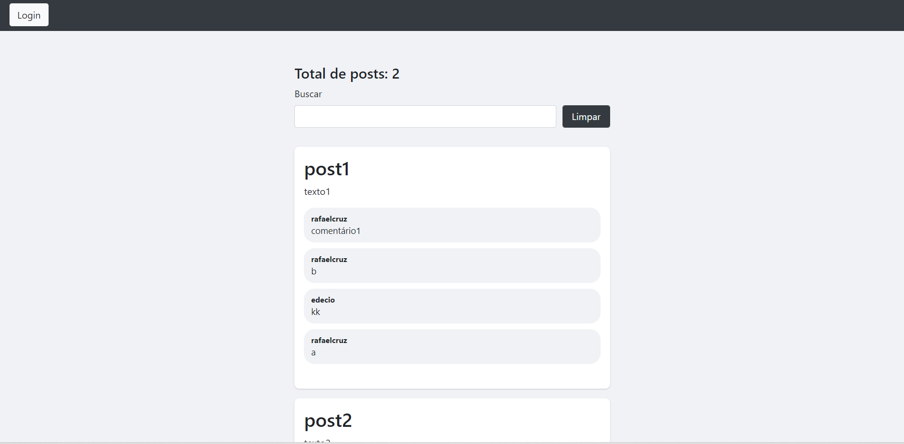

# senac-web-trab-3

## Posts

Esse repositório possui o backend e frontend de uma aplicação simples que possui alguns posts e usuários pré cadastrados.

Ao fazer login é possível interagir com os posts efetuando comentários, e podendo fazer uma busca por posts.




### Backend
Dentro do diretório do backend executar os comandos abaixo.

```bash
npm install
npm run start
```

### Frontend
Dentro do diretório do frontend executar os comandos abaixo.

```bash
npm install
npm run start
```